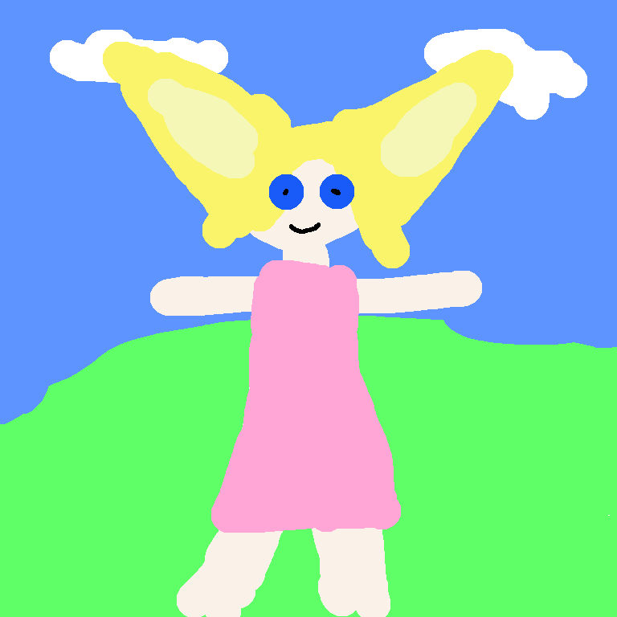
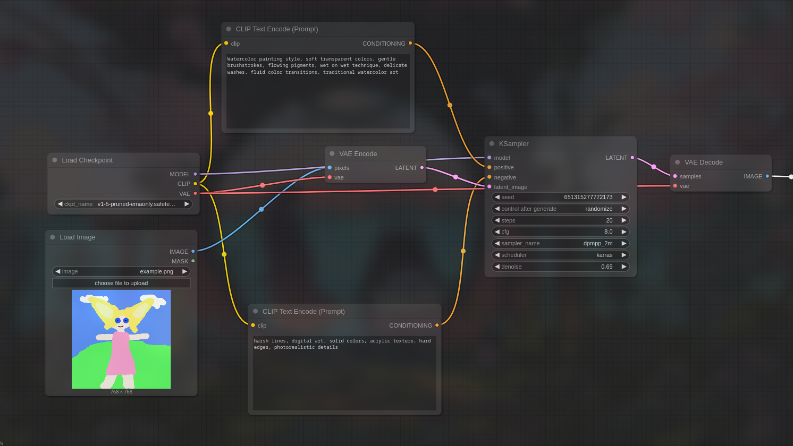

# Artistic Style Transfer System using ComfyUI

A generative AI implementation for applying artistic styles to images using Stable Diffusion and ComfyUI.

## Overview

This project implements an artistic style transfer system using ComfyUI and Stable Diffusion 1.5. The system transforms ordinary photographs into stylized images with artistic effects inspired by various painting styles.

## Technical Implementation

The workflow uses:
- Stable Diffusion 1.5 base model
- VAE encoding/decoding pipeline
- KSampler with DPM++ 2M Karras scheduler
- CLIP text conditioning for style guidance
- Denoising strength of 0.6-0.8 for optimal style transfer

## Example Results

| Original | Stylized (Van Gogh) | Stylized (Watercolor) |
|----------|---------------------|------------------------|
|  |  |  |

## Workflow Visualization

## Setup and Usage

1. Install ComfyUI following the [official instructions](https://github.com/comfyanonymous/ComfyUI)
2. Download SD 1.5 checkpoint from Hugging Face
3. Import the provided workflow JSON file
4. Replace the input image with your own
5. Adjust style prompts as desired

## Parameter Tuning

Different parameters affect the style transfer results:
- Higher CFG Scale (7-9): Stronger adherence to style prompt
- Lower Denoising (0.4-0.6): More preservation of original content
- Higher Denoising (0.7-0.9): More dramatic style application

## Challenges and Solutions

One of the main challenges was balancing content preservation with style application. Through experimentation, I found that combining precise text prompts with moderate denoising values provided the best results.

## Future Improvements

- Implement automatic parameter optimization
- Explore ControlNet for more precise style guidance
- Create a Python wrapper for batch processing
